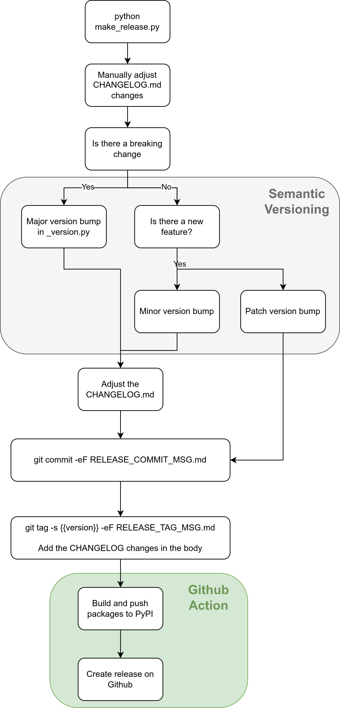

# Releasing

A `pypdf` release contains the following artifacts:

* A new [release on PyPI](https://pypi.org/project/pypdf/)
* A [release commit](https://github.com/py-pdf/pypdf/commit/91391b18bb8ec9e6e561e2795d988e8634a01a50)
    * Containing a changelog update
    * A new [git tag](https://github.com/py-pdf/pypdf/tags)
        * A [Github release](https://github.com/py-pdf/pypdf/releases/tag/3.15.0)

## Who does it?

`pypdf` should typically only be released by one of the core maintainers / the
core maintainer. At the moment, this is Martin Thoma.

Any owner of the py-pdf organization has also the technical permissions to
release.

## How is it done?

The release contains the following steps:

1. Create the changelog with `python make_changelog.py` and adjust the `_version.py`
2. Create a release commit
3. Tag that commit
4. Push both
5. CI now builds a source and a wheels package which it pushes to PyPI. It also
   creates a GitHub release.



### The Release Commit

The release commit is used to create the GitHub release page. The structure of
it should be:

```
REL: {{ version }}

## What's new

{{ CHANGELOG }}
```

### The Release Tag

* Use the release version as the tag name. No need for a leading "v".
* Use the changelog entry as the body


## When are releases done?

There is no need to wait for anything. If the CI is green (all tests succeeded),
we can release.

I (Martin Thoma) typically only release once a week, because it costs a little
bit of time and I don't want to spam users with too many releases.
